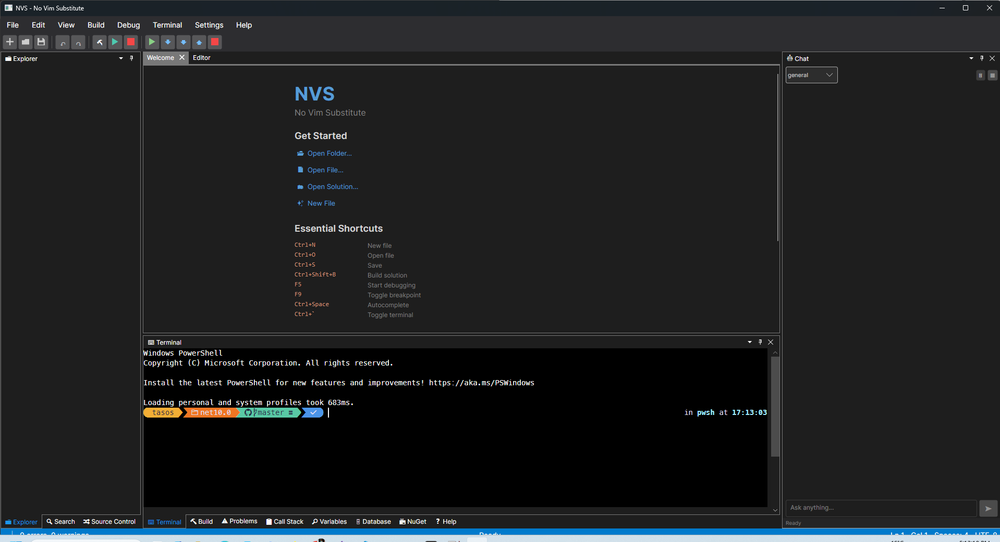

# NVS — No Vim Substitute

> *We're honest about it.*

A cross-platform IDE built with .NET 10 and AvaloniaUI — proudly assembled using **AI-Sloptronic™** technology, where every line of code was generated with the unwavering confidence of a machine that has never once questioned whether a `PatchEntryChanges` type actually has a `Hunks` property. (It didn't.)

[](https://github.com/tkleisas/nvs/actions/workflows/build.yml)
[](LICENSE)


---



## What Is This?

NVS is a code editor / IDE that:

- **Does not replace Vim.** We cannot stress this enough.
- Runs on Windows, macOS, and Linux (thanks Avalonia).
- Has language server support for 14+ languages with auto-completion and signature help.
- Has Roslyn-powered C# intelligence: completions, hover, go-to-definition, references, diagnostics, signature help, formatting — no external language server needed.
- Has a built-in PTY terminal that actually works.
- Has git integration that will absolutely let you force-push to main.
- Has .NET solution/project loading with full build integration.
- Has DAP-based debugging with breakpoints, call stack, and variable inspection.
- Has an AI chat assistant that can read and modify your project files.
- Has a NuGet package manager, a multi-database explorer (SQLite, PostgreSQL, SQL Server, Oracle), and a built-in HTTP API client.
- Has Roslyn-based code metrics with gutter indicators and a dashboard panel.
- Supports multi-project solutions with startup project selection.
- Can be launched from the command line: `nvs mysolution.sln` or `nvs ./myproject/`.
- Was built in a series of increasingly ambitious "phases" by a human and an AI who kept saying "let's continue."
- Has 1204 tests, which is 1204 more than the AI thought were necessary before the human insisted.

## Features

### 🖊️ Editor
- Syntax highlighting for 16 languages (C#, C/C++, TypeScript, JavaScript, Python, Rust, Go, Java, PHP, JSON, HTML, CSS, YAML, Markdown, TOML, XML)
- Undo/Redo, Find & Replace (Ctrl+Z, Ctrl+Y, Ctrl+F)
- Multi-tab editing with dirty indicators, line/column tracking
- Right-click context menu (Cut, Copy, Paste, Select All, Go to Definition)
- Dockable panels via Dock.Avalonia — drag, split, and rearrange
- **Bracket matching** — highlights matching `()` `{}` `[]` at caret position
- **Code folding** — brace-based folding for C-style languages, indentation-based for Python/YAML
- **Minimap** — scaled document overview with viewport indicator, click-to-scroll
- **Split editor** — vertical/horizontal split (Ctrl+\\, context menu, View menu)
- **Multiple cursors** — Ctrl+D for next occurrence, Ctrl+Alt+Up/Down to add cursor above/below, Escape to clear
- Compiled bindings for that sweet, sweet performance

### 🧠 Language Server Protocol (LSP) & Roslyn
- **Roslyn-powered C# language service** — completions (including `.` trigger), hover tooltips, go-to-definition, find references, document symbols, diagnostics, signature help, and document formatting — all via in-process MSBuildWorkspace with no external server
- Full JSON-RPC 2.0 transport layer for non-C# languages
- Auto-completion with trigger characters (`.`, `<`, `:`) and debounced identifier completion
- Signature help / parameter info on `(` and `,`
- Go to Definition (F12)
- Code Actions / Quick Fixes (Ctrl+.)
- Inline diagnostics with squiggly underlines
- Incremental document sync (`textDocument/didChange`)
- 14 open-source language servers, installable from Settings:

| Server | Languages | Install |
|--------|-----------|---------|
| csharp-ls | C# | `dotnet tool` |
| clangd | C, C++ | Manual download |
| typescript-language-server | TypeScript, JavaScript | `npm` |
| pylsp | Python | `pip` |
| rust-analyzer | Rust | Manual download |
| gopls | Go | `go install` |
| jdtls (Eclipse JDT.LS) | Java | Manual download |
| phpactor | PHP | `composer` |
| vscode-json-language-server | JSON | `npm` |
| vscode-html-language-server | HTML | `npm` |
| vscode-css-language-server | CSS/SCSS/LESS | `npm` |
| yaml-language-server | YAML | `npm` |
| marksman | Markdown | Manual download |
| taplo | TOML | `cargo` |

### 📊 Code Metrics & Linting
- Roslyn-based code metrics analysis (cyclomatic complexity, maintainability index, lines of code)
- Code Metrics Dashboard panel with project → file → type → method tree view
- Severity indicators: 🟢 healthy, 🟡 moderate, 🔴 complex
- Inline gutter dots next to methods colored by complexity
- Status bar shows current method metrics at cursor position
- Analyze entire workspace or individual files

### 🔀 Git Integration
- Repository status, staging, unstaging
- Commit with message (the AI suggested "fix stuff" for every commit message)
- **Amend last commit** — edit the most recent commit message or contents
- Branch management (create, checkout, delete, list)
- Commit log
- **Side-by-side diff viewer** — click any changed file to see additions (green) and deletions (red) in a split view, supports both staged and unstaged diffs
- **Merge conflict resolution** — 3-pane resolver with Accept Current / Accept Incoming / Accept Both per conflict block
- **Partial (hunk) staging** — stage or unstage individual hunks via `git apply --cached`
- **Reset, Rebase** — soft/mixed/hard reset, interactive rebase onto branch
- Diff viewer with unified patch parsing — implemented on the third attempt after the AI hallucinated two different diff libraries that don't exist
- Source Control sidebar panel
- Branch picker in the status bar

### 💻 Terminal
- Built-in PTY terminal panel (Ctrl+`) via Iciclecreek
- Cross-platform shell detection (pwsh → PowerShell → cmd on Windows; `$SHELL` on Unix)
- Multiple terminal instances — for when one terminal full of errors isn't enough
- Configurable fonts (MesloLGM Nerd Font etc.)

### 🏗️ Solution & Build
- Open .sln, .slnx, and .csproj files
- Multi-project solution support with correct tree structure
- Solution Explorer tree with project structure and file icons
- **Startup project selection** — toolbar dropdown or right-click → "Set as Startup Project"
- Build, Rebuild, Clean (Ctrl+Shift+B)
- Run without debugging (Ctrl+F5) — GUI apps launch as detached windows, console apps run in terminal, **web apps run with the selected launch profile** (`dotnet run --launch-profile`) and auto-open a browser
- **Web application run/debug** — launchSettings.json parsing, launch-profile selector (toolbar dropdown + Settings → Web / Launch), cross-platform browser launch, and live "Now listening on:" URL scraping for the debug browser launch (with a static fallback)
- Build Output panel with auto-scroll and MSBuild error parsing
- Problems panel with click-to-navigate diagnostics
- New project / file-from-template scaffolding via `dotnet new`, Maven, and Composer
- Add existing project to solution

### 🐛 Debugging (DAP)
- Debug Adapter Protocol client with Content-Length framed transport
- **netcoredbg** auto-downloaded on first use (~3 MB) — no manual install needed. The AI tried to implement a debugger from scratch before the human said "just use netcoredbg"
- **Java** debugging via java-debug (JDT.LS plugin, EPL-1.0)
- **PHP** debugging via vscode-php-debug (Node.js DAP↔Xdebug bridge, MIT)
- Start Debugging (F5), Stop (Shift+F5)
- Step Over (F10), Step Into (F11), Step Out (Shift+F11)
- Toggle Breakpoint (F9) with red gutter markers
- Call Stack panel with frame navigation
- Variables panel with expandable tree view (lazy-loaded children)
- Debug output streamed to Build Output panel
- Debug toolbar with visual step controls
- Console apps debug in integrated terminal; GUI apps debug directly

### 💬 LLM Chat Assistant
- Built-in AI chat panel with streaming responses
- Any OpenAI-compatible endpoint (OpenAI, OpenRouter, DeepSeek, Ollama, LM Studio)
- Task modes: General, Coding, Debugging, Testing — each with tailored system prompts
- **12 agent tools**: file read/write, search, terminal commands, git status/diff, build, test, diagnostics, and editor integration
- **Chat session persistence** — conversations saved to SQLite per workspace, survive restarts, create/switch/delete sessions via dropdown
- **Code block highlighting** — assistant responses render code blocks with syntax highlighting, copy and apply-to-editor buttons
- **Context enrichment** — attach files (📎), auto-includes open files, diagnostics, git branch/status in prompts
- **Vision/image support** — attach images (📷) for multimodal models, base64 data URI encoding
- **Inline ghost-text completions** — LLM-powered code suggestions appear as dimmed text after cursor, accept with Tab, dismiss with Escape
- Configurable model, temperature, max iterations, and prompt templates
- Yes, we built an AI-powered IDE using AI. It's slop all the way down.

### 📦 NuGet Package Manager
- Browse, search, and install packages from nuget.org
- View installed packages per project
- Check for and apply updates
- Uninstall and restore packages
- Project selector for multi-project solutions

### 🗄️ Database Explorer
- Embeds the [SQLiteExplorer](https://github.com/tkleisas/SQLiteExplorer) component as a dockable panel (View → Database Explorer)
- Multi-engine: **SQLite** (.db/.sqlite/.sqlite3 files), **PostgreSQL**, **SQL Server**, and **Oracle** via connection dialogs
- Browse tables, views, and schemas in the object tree
- Run SQL in query tabs; results render in a high-performance virtualized data grid
- Multiple simultaneous connections and a built-in SQL cheatsheet
- Caused a docking crash that took longer to fix than the entire feature took to build. Classic.

### 🌐 API Client
- Embeds the [ApiClient](https://github.com/tkleisas/ApiClient) component as a dockable panel (View → API Client) — a Postman/Bruno-style HTTP client, fully offline, no account required
- File-based collections (one plain-text file per request, git-friendly); imports Bruno collections
- Full request editor (method, URL, params, headers, body, auth) with status/timing/size on the response
- Response viewer with syntax highlighting and a virtualized tabular view for large JSON arrays; request history with replay
- Environments and `{{variable}}` substitution, keeping secrets out of version control
- Code generation (C#-first: HttpClient, Refit, RestSharp; JSON → records) and pre/post-request JavaScript scripting (Jint) with `req`/`res`/`bru`/`crypto` and `test`/`expect`

### ❓ Help System
- Welcome tab with getting started links and feature overview
- Searchable help panel (F1) with 13 built-in topics
- Keyboard shortcuts reference
- Contextual tooltips on all toolbar buttons
- The help content was written by the AI, so it sounds very confident about features that were definitely not tested on macOS

### ⚙️ Settings
- 5-section settings UI (General, Editor, Terminal, Language Servers, LLM)
- **4 built-in themes**: NVS Dark (default), NVS Light, Monokai, Solarized Dark
- Live theme switching with no restart required
- LLM configuration: endpoint, API key, model, temperature, streaming, prompt templates
- Language server discovery, status, and one-click install
- Window state persistence (size, position, maximized)
- Settings persisted to `%APPDATA%/NVS/settings.json`

### ⚠️ Prerequisite Warnings
- Automatic detection of missing SDKs/runtimes when opening a workspace
- Scans workspace files to detect languages in use
- Checks PATH for required binaries (dotnet, java, node, python, php, go, rustc, gcc)
- Shows dismissible info bars with install hints

### 📁 Explorer
- File tree with type-specific icons (🟢 C# · 🔵 C++ · 🟡 JS · 🔷 TS · 🐍 Python · 🦀 Rust · and more)
- Compact indentation with expand/collapse state
- Double-click to open files
- Right-click context menu: New File, New Folder, Delete, Set as Startup Project

### 🖥️ Command Line
- Open a solution: `nvs path/to/solution.sln`
- Open a folder: `nvs path/to/project/`
- Open a file: `nvs path/to/file.cs`
- CLI argument takes precedence over session restore

## Architecture

```
NVS (UI)  →  NVS.Services / NVS.Infrastructure  →  NVS.Core
                                                      NVS.Plugins
```

| Project | Role |
|---------|------|
| **NVS.Core** | Interfaces and models only. No implementations. The Switzerland of the codebase. |
| **NVS.Services** | All the actual work: Editor, FileSystem, Workspace, Language, LSP, Git, Terminal, Settings, Solution, Build, Debug, LLM, NuGet, Code Metrics. The load-bearing wall of this house of cards. |
| **NVS.Infrastructure** | DI registration, Serilog logging config. |
| **NVS.Plugins** | Plugin loading via `AssemblyLoadContext`. Currently quiet. Suspiciously quiet. |
| **NVS** | The Avalonia UI app — ViewModels, Views, Behaviors, and the DI composition root. |

## Getting Started

### Prerequisites

- [.NET 10 SDK](https://dotnet.microsoft.com/download)
- Git (for version stamping)
- A willingness to use an IDE built by a machine that once tried to `using LibGit2Sharp.Hunks` with zero remorse

### Build & Run

```bash
# Build
dotnet build NVS.slnx

# Run
dotnet run --project src/NVS

# Open a solution directly
dotnet run --project src/NVS -- path/to/solution.sln

# Run tests (1204 of them)
dotnet test NVS.slnx
```

There is no separate lint command. Code style is enforced at build time via `TreatWarningsAsErrors`, `EnforceCodeStyleInBuild`, and the .NET analyzers. If it builds, it's "lint-passing." If it doesn't build, well, that's a different kind of feedback.

### Run a Single Test

```bash
dotnet test NVS.slnx --filter "FullyQualifiedName~GitServiceParsePatchTests.ParsePatch_MixedChanges"
```

## Downloads

Self-contained builds (no .NET runtime needed) are published on each tagged release:

| Platform | Archive |
|----------|---------|
| Windows x64 | `nvs-win-x64.zip` |
| Linux x64 | `nvs-linux-x64.tar.gz` |
| macOS x64 | `nvs-osx-x64.tar.gz` |
| macOS ARM64 | `nvs-osx-arm64.tar.gz` |

See [Releases](https://github.com/tkleisas/nvs/releases) for downloads.

To create a release, tag a commit and push:

```bash
git tag v0.5.0
git push origin v0.5.0
```

## Tech Stack

| Component | Technology |
|-----------|------------|
| UI Framework | [AvaloniaUI](https://avaloniaui.net/) 12.0 |
| Text Editor | [AvaloniaEdit](https://github.com/AvaloniaUI/AvaloniaEdit) 12.0 |
| Docking | [Dock.Avalonia](https://github.com/wieslawsoltes/Dock) 12.0 |
| Terminal | [Iciclecreek.Avalonia.Terminal](https://github.com/tomlm/Iciclecreek.Avalonia.Terminal) 2.0 |
| Database Explorer | [SQLiteExplorer](https://github.com/tkleisas/SQLiteExplorer) (embedded, multi-engine) |
| API Client | [ApiClient](https://github.com/tkleisas/ApiClient) (embedded) |
| MVVM | [CommunityToolkit.Mvvm](https://learn.microsoft.com/dotnet/communitytoolkit/mvvm/) 8.4 |
| Git | [LibGit2Sharp](https://github.com/libgit2/libgit2sharp) 0.31 |
| Code Metrics | [Microsoft.CodeAnalysis](https://github.com/dotnet/roslyn) (Roslyn) |
| C# Language Service | [Microsoft.CodeAnalysis](https://github.com/dotnet/roslyn) (Roslyn MSBuildWorkspace) |
| Debugging | [netcoredbg](https://github.com/Samsung/netcoredbg) (MIT, auto-downloaded) |
| Java Debug | [java-debug](https://github.com/microsoft/java-debug) (EPL-1.0, JDT.LS plugin) |
| PHP Debug | [vscode-php-debug](https://github.com/xdebug/vscode-php-debug) (MIT, Node.js) |
| Logging | [Serilog](https://serilog.net/) 4.2 |
| Runtime | .NET 10 (preview) |
| Theme | Fluent Dark/Light + 4 built-in themes (NVS Dark, NVS Light, Monokai, Solarized Dark) |
| Testing | xUnit + FluentAssertions + NSubstitute |

## Testing

1204 tests across 4 test projects. Every single one demanded by the human, who apparently doesn't trust code written by a language model. Can't imagine why.

- **NVS.Core.Tests** — Core model tests
- **NVS.Plugins.Tests** — Plugin system tests
- **NVS.Services.Tests** — EditorService, LanguageService, LSP, Git, Terminal, Registry, Solution, Build, DAP, Debug, Breakpoints, LLM Agent Tools, Inline Completions, Chat Sessions, NuGet, Code Metrics
- **NVS.Tests** — ViewModel tests (Editor, Document, Settings, MainViewModel, Build/Run, LLM Chat, NuGet, Help, Welcome)

Test naming convention: `MethodName_Scenario_ExpectedOutcome`

```csharp
[Fact]
public void ParsePatch_MixedChanges_ParsesAllLineTypes()
{
    // ...
}
```

## Versioning

- Version lives in `Directory.Build.props`
- Informational version appends the short git commit hash (e.g., `0.4.4+a3f72b1`)
- Patch bumps on each commit, minor bumps on feature completion
- Viewable in **Help → About**

## License

MIT — see [LICENSE](LICENSE) for details.

---

<p align="center">
  <i>NVS: Because the world needed another text editor, and we were too far in to stop.</i>
  <br/>
  <i>Built with ❤️ and approximately 47 "retry" commands.</i>
</p>
